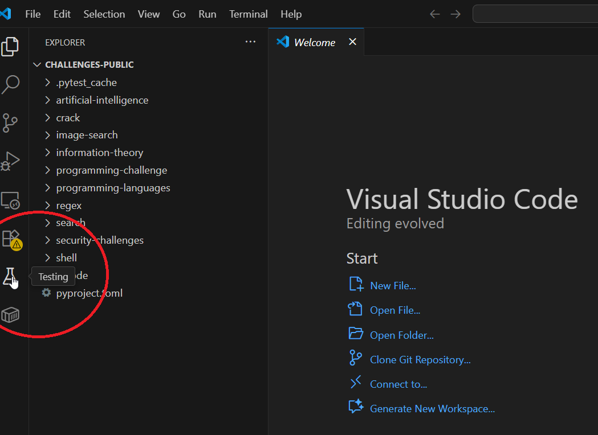
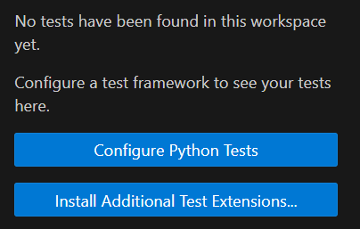
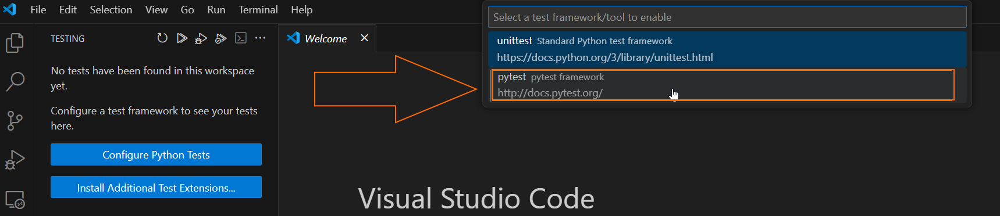
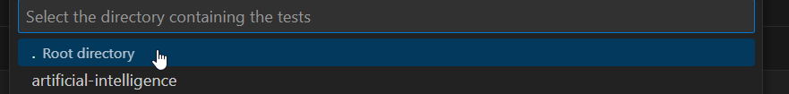
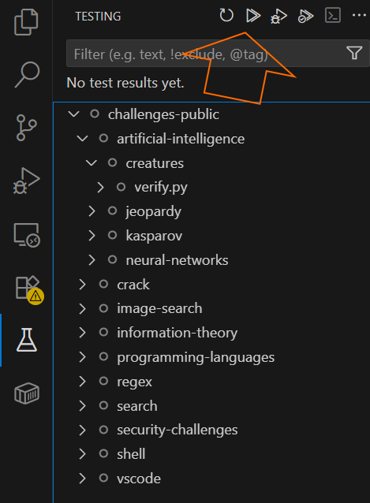
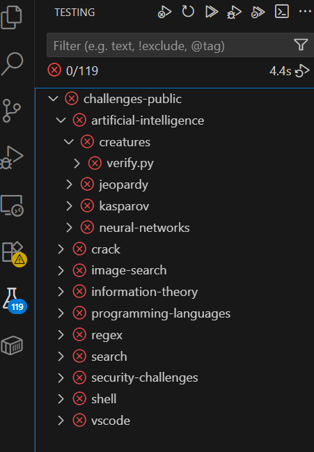

# Structure 

De challenges zijn georganiseerd aan de hand van directories (mappen). Open de 'challenges' folder in vscode.

Als je de challenges correct hebt gedownload/geopend, zie je aan de linkerkant (kan verplaatst zijn) de volgende structuur. Het kan zijn dat je wat folders moet openklappen, en het kan ook lichtjes afwijken van wat hier staat (dat betekent gewoon dat wij nog een paar wijzigingen gedaan hebben).

```text
challenges
    artificial-intelligence
        creatures
            description.md
            verify.py
        jeopardy
            description.md
            verify.py
        kasparov
            description.md
            verify.py
        neural-networks
            description.md
            network.png
            neuron.png
            verify.py
    crack
        concealed-image
            description.md
            verify.py
            whoami.png
        hash
            description.md
            verify.py
        password-1
            description.md
            PasswordChecker.class
            verify.py
        password-2
            description.md
            PasswordChecker.class
            verify.py
    ...
```

De folders met folders erin (bvb de folder 'crack' bevat 'hash') zijn puur om dingen te organiseren per thema. Een enkele 'challenge' is een map met daarin een 'verify.py' file, een 'description.md', en eventueel andere files.

# Een challenge oplossen

Laten we beginnen bij het begin, de challenge `artificial-intelligence/creatures`. De folder bevat onder andere de volgende files:

* `description.md` bevat de opgave van de challenge. Je begint de challenge door deze file te openen en door te lezen. Het type van de file is een markdown file (net als deze trouwens), die bevatten altijd tekst, en zijn leesbaar voor mensen (vreemde zin misschien, maar sommige bestanden zijn enkel leesbaar voor computers)
* `verify.py` is een Python file, vol met code die de lectoren geschreven hebben om automatisch je oplossing te verbeteren
* De overgrote meerderheid van de challenges verwacht dat je je antwoord in een file `solution.txt` zet. Deze file bestaat nog niet, dus je zal hem zelf moeten maken. In `vscode` kan je rechtsklikken op de folder van de challenge, en `New File...` klikken. Je nieuwe file verschijnt, en je moet enkel nog de naam `solution.txt` typen en op enter duwen. 

Om de challenge op te lossen, moet je dus `description.md` lezen, een nieuwe file `solution.txt` maken, je antwoord erin typen, en het saven (Ctrl+s op Windows/Linux, Command+s op macOS).

Het leuke aan de challenges is dat je meteen weet of het antwoord correct is of niet. Daarvoor gebruiken vscode's functionaliteit `Python Test Framework` om testen in python te runnen (onze `verify.py`'s). Klik het icoontje van een fles aan de linkerkant van vscode.



Vraagt vscode om de test omgeving te configureren (zoals onderstaande afbeelding)?



Volg dan de volgende stappen: 
* Klik 'Configure Python Test'
* Een popup bovenaan in het midden zou je de optie 'pytest pytest framework' moeten geven. Klik erop 
* Selecteer daarna '. Root directory' 

Als die configuratie goed gelukt is, zou je (met de fles geselecteerd) alle challenges moeten zien in een hierarchische structuur, met een grijze cirkel ernaast



Ieder element is een challenge, en iedere challenge is een pytest. Ik zeg het maar, want de kans is groot dat ik in de toekomst nog eens 'test' ga gebruiken wanneer ik 'challenge' bedoel.

De grijze cirkel toont aan dat de status van de challenges *onbekend* is, we weten niet of de challenge correct of niet correct opgelost is. De reden daarvoor is dat we de challenge nog niet 'gerund' hebben, of in Visual Studio, de test nog niet gerund hebben. Klik de dubbele pijlen bovenaan, aangeduid met een oranje pijl in de afbeelding hierboven. Er zou een hoop moeten bewegen in vscode, en uiteindelijk zouden alle tests moeten falen/rood zijn.



De meer dan honderd tests die vroeger een onbekende status hadden, falen. Hoera, we zijn al verder! Dat is niet sarcastisch bedoeld, we hebben effectief vooruitgang gemaakt. Als IT'er zijn we soms blij als we weten dat de server in brand stond, als we daarvoor paniekerig zochten waarom de website niet werkt ;)

Nu weet je hoe je je challenges kan oplossen, en hoe je kan controleren of je oplossing correct is. Nog een belangrijk ding: hoe je je oplossingen bewaart, en hoe je je oplossing indient (het is maar 1 ding, want het gebeurt op exact dezelfde manier)

# Je oplossingen bewaren : werken met je repository

Nota: normaal gezien ga je enkel meerdere `solution.txt` files maken en waar je je oplossingen zet. Het is best geen verandering te maken aan `description.md` of `verify.py`

Volg de volgende stappen om je huidige oplossingen te saven en te uploaden naar GitHub (dit doe je best vaak, want het is ook een veilige backup. Ik raad aan dat je het doet iedere keer dat je stopt met aan de challenges te werken).

```bash
# Navigeer naar de directory van de challenges

# Laat git weten dat je de `solution.txt` file wilt toevoegen aan de commit
git add solution.txt

# Maak de commit met alles wat je ge-add hebt (je kan meerdere files toevoegen, of alles in een directory en de directories eronder met git add .). Het bericht op het einde is verplicht. Maak er iets van wat je later nog iets aan hebt. En hou het SFW, als lector kan ik het zien :)
git commit -m 'solved creatures challenge'

# We hebben nu een commit, maar die bestaat enkel op de lokale computer (een hele IT-manier om te zeggen: de computer waar je nu aan zit)
# We moeten nu enkel nog onze commit uploaden naar GitHub
git push

# Als je wil checken of het gelukt is, ga naar de repository op github, en check de commits. Je zou iets moeten zien als `solved creatures challenge 2 minutes ago`
```

## Meerdere files committen in een enkele commit

Als je meerdere (of zelfs een hoop) `solution.txt` files wilt committen, moet je ze niet individueel toevoegen door `git add`. Ga naar de hoogste challenge directory, en gebruik de volgende commando's:

```bash
# Add all solution.txt files in one go
find . -name "solution.txt" | xargs git add
git commit -m 'solved challenges information-theory'
git push
```

`find` vindt alle files met een zekere naam in de huidige directory, of directories eronder (die in die directory zitten). `xargs` is een duct tape (lelijke oplossing) die de resultaten van `find` overdraagt naar `git add`. Ik verwacht niet dat je dit exact kunt uitleggen, maar gebruik het zeker.

Ik zeg altijd tegen mijn studenten dat een IT'er op de juiste manier lui moet leren zijn. De juiste luiheid is een manier vinden dat je hetzelfde bereikt op een manier die minder moeite vergt, zeker als je iets vaak moet doen. Dit noemen we ook *automatiseren*, of, in plaats van zelf iets te doen, een commando/script/programma maken dat het voor ons doet.

Misschien vraag je je nu af wat de slecht luiheid is? Een IT'er die vlug een repetitief taakje van een uur doet, omdat die liever niet een programma schrijft om het automatisch te doen.

Een twijfelgeval is de IT'er die een repetitief taakje van een uur automatiseert door er een week lang een programma voor te schrijven, omdat dat efficiënter is. Je weet dat je een IT'er bent als je je erop betrapt.

# Klaar zijn met challenges

Moet je alle challenges maken? Absoluut niet (gelukkig). We hebben veel challenges gemaakt, in de hoop dat jullie al ontdekken welke domeinen binnen IT je eerder (niet) liggen.

__Om de challenges opdracht volledig te voltooien moet je minstens de helft (naar beneden afgerond) van de challenges oplossen, en verdedigen op het mondeling examen. Je mag zelf kiezen van welke categorieën je de challenges wilt oplossen.__

# Challenges updaten

We rekenen er niet op, maar het kan zijn dat we veranderingen aan de challenges maken terwijl je eraan bezig bent. Sowieso posten we het op Toledo met een verwijzing naar deze instructies.

Alle veranderingen maken we in deze repository:  `https://github.com/UCLL-introproject/aostudents-starter.git`. Jammer genoeg zal jouw repository niet automatisch geüpdatet worden. 

Volg de volgende commando's (eerst moet je natuurlijk onze Git / GitHub guide gevolgd hebben)

```bash
git pull upstream main
```

Dat *zou* het moeten zijn. Als je een error ziet, is het hoogstwaarschijnlijk een van de volgende twee:


**Error 1: unknown remote**
```bash
git pull upstream main

fatal: 'upstream' does not appear to be a git repository
fatal: Could not read from remote repository.
```

Dit betekent dat je remotes niet correct geconfigureerd zijn.

Commando:
```bash
git remote add upstream https://github.com/UCLL-introproject/aostudents-starter.git
```

en probeer nog eens te pullen

**Error 2: uncommitted changes**

Git wilt er zeker van zijn dat je werk niet verloren gaat. Deze error betekent dat je lokaal (op jouw computer) veranderingen hebt, en dat je deze moet committen met `git add/commit`, of ongedaan maken. Je komt te weten welke files veranderd zijn met 


Commando:
```
git status
```
